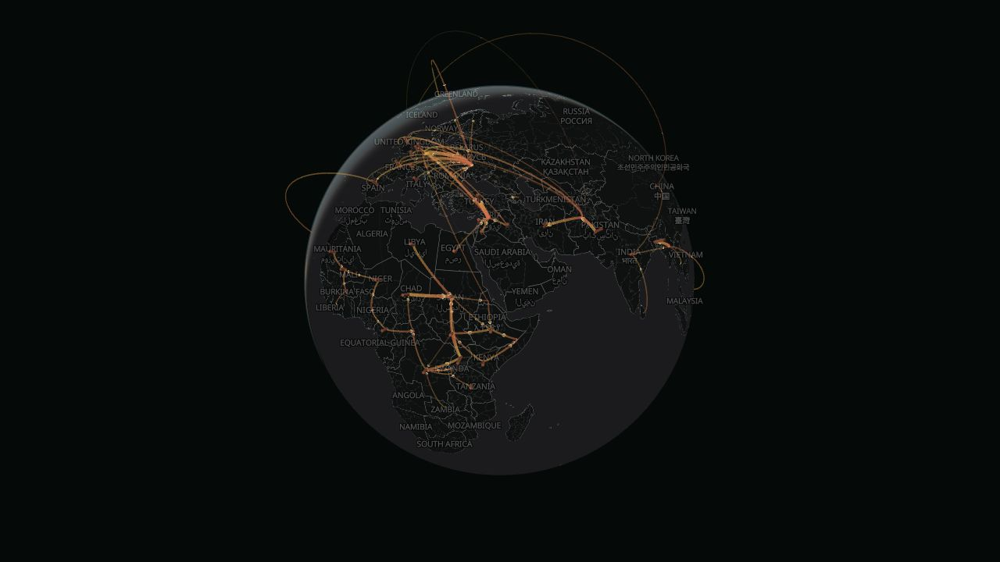

# Displacement Globe

[Displacement Globe](https://displacementglobe.lucasspeciale.com) is a time-first exploration of recorded forced-displacement relationships from 2000 through 2025. Rotate the globe, play or scrub the timeline, switch among four UNHCR data views, and select a country to isolate inbound or outbound corridors.



## What it demonstrates

- A MapLibre globe with deck.gl arcs, columns, labels, and animated route particles
- Four distinct views of the UNHCR record: hosted refugees, new asylum claims, returns, and resettlement
- A shared timeline with annual interpolation and mode-specific coverage
- Bidirectional country focus for tracing origins and destinations
- An offline validation pipeline and compact static deployment with no production data API

The visual language is deliberately restrained. Arcs describe relationships in the published data; they are not presented as literal journeys or exact travel paths.

The product and architecture brief is available in [PROJECT_PLAN.md](PROJECT_PLAN.md).

## Local development

Requires Node.js 20+ and pnpm 11.19.0.

```bash
pnpm install
pnpm dev
```

Open [http://localhost:3000](http://localhost:3000). Before handing off a change, run:

```bash
pnpm test
pnpm lint
pnpm build
```

The production build is a static export in `out/`.

## Architecture

- Static Next.js, React, and strict TypeScript application
- MapLibre GL JS globe using OpenFreeMap's Dark style
- deck.gl ArcLayer, ColumnLayer, and particle layers inside MapLibre's rendering stack
- Pure calculation and scaling utilities covered by Vitest
- Offline Python normalization and validation
- Compact static JSON partitions loaded directly by the browser
- No database, application server, or production-time UNHCR API dependency

```text
UNHCR downloadable exports + country geometry
                         ↓ offline Python build
Validated annual mode partitions
                         ↓ static hosting
Next.js + MapLibre globe + deck.gl layers
```

## Data build

Place these source snapshots under `data/raw/unhcr/`:

- `population-2000-2025.zip`
- `asylum-applications-2000-2025.zip`
- `solutions-2000-2025.zip`

Place normalized World Bank geometry at `data/raw/world-bank/geometry.geojson`, then run:

```bash
pnpm data:build
```

The build produces per-year, per-mode route partitions, country metadata, normalized geometry, a manifest, and an ignored audit report. It rejects negative values, omits internal and unmappable international routes, and limits asylum claims to new first-instance applications reported as persons.

Raw sources and detailed reports are ignored. Validated browser assets under `public/data/displacement/` are intentionally tracked so the static site can build without source archives.

## Interpretation and limitations

- Hosted refugee arcs are end-of-year stock relationships, not annual journeys.
- Claims are new first-instance asylum applications reported as people, not confirmed movement.
- Return arcs run from the country of asylum or departure toward the country of origin.
- Resettlement arcs connect origin or nationality to the final arrival country; origin is not necessarily physical departure.
- IDPs, returned IDPs, and naturalisation are excluded from the international route layers.
- Small published values may be rounded for confidentiality, so totals should be understood as approximate.
- Country boundaries support geographic navigation and do not imply a position on legal or political status.

## Repository guide

```text
src/app/                            Next.js entry point and visual system
src/components/                     Globe, controls, guide, and country detail
src/lib/                            Flow, formatting, and globe calculations
src/types/                          Shared data contracts
scripts/build_data.py               Offline normalization and validation
scripts/provision-cloudflare.mjs    Idempotent deployment provisioning
public/data/displacement/           Deployable generated data
docs/displacement-globe-preview.jpg Repository preview image
.github/workflows/                  Test, build, and Cloudflare deployment
```

## Data and attribution

- Primary data: [UNHCR Refugee Population Statistics Database](https://www.unhcr.org/refugee-statistics/), generally licensed under CC BY 4.0
- Required attribution: “UNHCR Refugee Population Statistics Database”
- Boundary geometry: [World Bank Official Boundaries](https://datacatalog.worldbank.org/search/dataset/0038272/world-bank-official-boundaries)
- Basemap: [OpenFreeMap](https://openfreemap.org/) using OpenMapTiles and OpenStreetMap data

See [THIRD_PARTY_NOTICES.md](THIRD_PARTY_NOTICES.md) for the repository's attribution and licensing boundaries.

## Deployment

Pushes to `main` run tests, lint, and the production build before deploying the Cloudflare Pages project `displacement-globe`. The workflow can provision the Pages project and `displacementglobe.lucasspeciale.com` custom domain when deployment credentials are available.

## Source availability

This repository is published as portfolio source, not as an open-source project. Original code and visual design are copyright Lucas Speciale and are provided under the terms in [LICENSE](LICENSE). Third-party data and dependencies retain their respective licenses.
